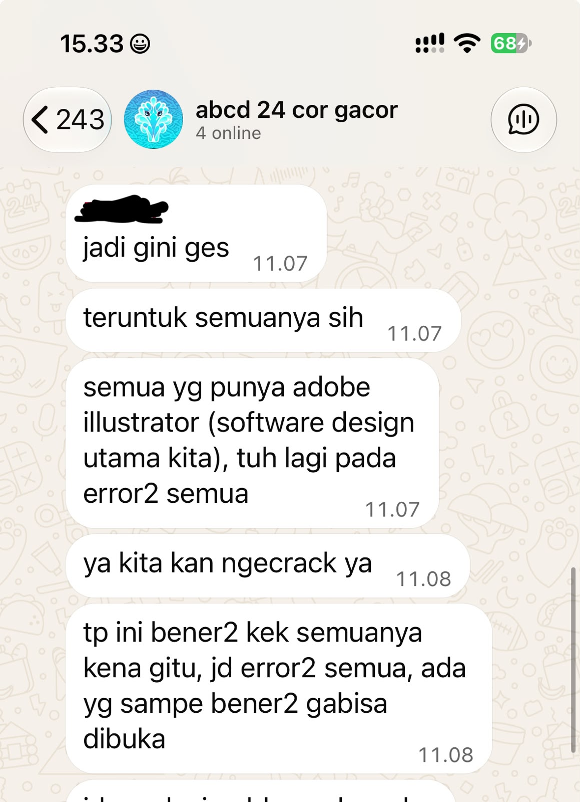

## Kompetensi target

Membedakan person, personality, dan character serta memilih objective, repertoire, dan language yang sesuai.

## Evidence wajib

- Lima character dari sedikitnya tiga domain kehidupan.
- Objective, responsibility, repertoire, dan risiko tiap character.
- Satu contoh perubahan language ketika character berubah.

::: {.callout-tip title="Lihat contoh pengisian"}
[Buka contoh fiktif Minggu 1](../examples/week-01.qmd) untuk melihat tingkat kekonkretan evidence dan analisis. Jangan menyalin contoh sebagai evidence pribadi.
:::

## Cara mengisi cepat

1. Pilih satu kejadian komunikasi nyata yang masih Anda ingat.
2. Catat fakta yang bisa diamati; pisahkan dari dugaan atau penilaian.
3. Isi tabel dan episode dengan kata kunci lebih dahulu, lalu lengkapi dialog atau tindakan yang benar-benar terjadi.
4. Tautkan evidence yang tersedia. Jika belum ada, tulis rencana mengumpulkannya; jangan membuat-buat bukti atau feedback.

## Lima character

Tabel berikut adalah draf pemetaan peran komunikasi saya. Nama orang lain disamarkan untuk menjaga privasi.

| Domain dan character | Person & relationship | Objective & responsibility | Repertoire & language | Risiko dan latihan |
|---|---|---|---|---|
| Intra-Self — Reflective learner | Diri sendiri saat mengevaluasi tugas, keputusan, pengalaman organisasi, dan feedback | Memisahkan fakta dari asumsi, mengevaluasi diri secara objektif, dan menentukan perbaikan tanpa menyalahkan diri sendiri | Refleksi tertulis; memeriksa fakta sebelum menarik kesimpulan | Terlalu cepat menilai diri; catat fakta dan asumsi secara terpisah |
| Family / Friends — Supportive friend | Teman dekat yang ingin bercerita atau berdiskusi | Memahami kebutuhan teman dan memberi dukungan tanpa mengambil alih keputusannya | Mendengarkan dan bertanya terbuka; “Lo mau gue dengerin dulu atau kita cari solusi bareng?” | Terlalu cepat masuk ke mode solusi; tanyakan dulu bentuk dukungan yang diinginkan |
| Professional / Academic — Project team member / team coordinator | Rekan dalam tugas kuliah dan proyek akademik | Menyelaraskan pekerjaan, mengklarifikasi tugas, menjaga deadline, dan memastikan tanggung jawab dipahami | Check-in, klarifikasi, rangkuman tugas, dan konfirmasi tertulis | Terlalu mengandalkan asumsi bahwa semua anggota sudah memahami tugas; minta konfirmasi pemahaman |
| Community — Committee / event team member | Anggota organisasi, panitia, dan sub-divisi acara | Mengkoordinasikan pekerjaan dan komunikasi antar-sub-divisi untuk mencapai tujuan acara | Menetapkan target dan boundaries, memberi autonomy, meminta weekly progress, dan mengklarifikasi hambatan | Monitoring bisa kurang ketika terlalu percaya pada laporan; verifikasi status tanpa mengambil alih cara kerja |
| Public — Presenter / idea communicator | Audiens presentasi, kompetisi, atau kegiatan publik | Menyampaikan gagasan dengan jelas dan membantu audiens memahami pesan utama | Menyusun pesan utama dan menyesuaikan language dengan audiens | Terlalu fokus pada isi; periksa pemahaman audiens dan respons mereka |

## Episode yang dianalisis

**Konteks:** Saya menjadi penanggung jawab tim acara untuk sebuah lomba dan konser. Saya membawahi sub-divisi EO, Lapangan, dan Design, memberi tiap sub-divisi autonomy dalam memilih cara kerja dengan boundaries yang saya tetapkan, serta meminta target dan weekly progress.

**Person dan relationship:** Saya berperan sebagai penanggung jawab tim acara, sedangkan anggota Design adalah rekan satu tim yang bertanggung jawab atas pekerjaan desain. Hubungan kerja kami memerlukan trust, keterbukaan, koordinasi, dan kejelasan tanggung jawab.

**Initial state:** Saya beberapa kali menyetujui weekly progress Design berdasarkan laporan yang diberikan. Setelah kondisi pekerjaan diperiksa lebih detail, terlihat bahwa sebagian progress belum sesuai dengan kondisi aktual dan beberapa pekerjaan masih tertinggal. Saat itu saya belum memahami bahwa kendala utama yang menghambat tim adalah software desain yang bermasalah.

**Fakta yang saya amati:** Progress yang dilaporkan tidak sepenuhnya sesuai dengan kondisi aktual dan beberapa pekerjaan masih tertinggal. Dalam percakapan tim, anggota Design menyampaikan bahwa Adobe Illustrator—software utama untuk pekerjaan desain—sedang error dan ada anggota yang benar-benar tidak bisa membukanya. Gangguan ini berlangsung sekitar seminggu berdasarkan penjelasan tim dan menjadi hambatan utama pekerjaan. Workload yang padat juga menjadi faktor tambahan.

**Story atau asumsi yang muncul:** Sebelum memahami kendala software, saya sempat berpikir bahwa tim Design terlalu santai. Itu adalah asumsi awal, bukan fakta. Setelah membaca penjelasan tim tentang Adobe Illustrator yang error dan mengetahui workload mereka juga padat, saya memahami bahwa hambatan alat kerja merupakan penyebab utama yang perlu diperhitungkan, bukan langsung menyimpulkan bahwa tim kurang berusaha.

**Objective:** Saya ingin memahami dampak gangguan Adobe Illustrator terhadap pekerjaan, sekaligus mengetahui status dan workload tim, lalu menyepakati prioritas serta langkah tindak lanjut tanpa menghilangkan autonomy dan trust.

**Tanggung jawab character saya:** Sebagai penanggung jawab, saya perlu menetapkan target dan boundaries, memantau progress secukupnya, mengklarifikasi hambatan, membantu tim menyusun prioritas, dan menjaga komunikasi yang saling menghargai.

**Percakapan atau tindakan penting:** *Parafrasa dari kejadian, bukan kutipan kata per kata.* Setelah saya mengecek pekerjaan yang tertinggal, tim menyampaikan di grup bahwa Adobe Illustrator sedang error dan beberapa anggota tidak bisa membukanya. Gangguan tersebut berlangsung sekitar seminggu dan menjadi hambatan utama, sementara workload yang padat turut menambah tekanan. Setelah memahami kendalanya, saya berdiskusi dengan tim untuk membahas kembali prioritas, deadline, dan pekerjaan yang perlu segera diselesaikan.

**Response yang saya baca:** Pesan tim mengonfirmasi bahwa Adobe Illustrator mengalami error dan sebagian anggota tidak bisa membuka software tersebut. Informasi ini memberi konteks konkret tentang hambatan pekerjaan; workload padat merupakan faktor tambahan yang dijelaskan tim.

**Adaptation:** Saya mengubah pendekatan dari hanya mengandalkan weekly progress menjadi mengklarifikasi hambatan spesifik, terutama kondisi software utama yang digunakan tim, serta memeriksa status pekerjaan dan kebutuhan bantuan. Dengan memahami gangguan Adobe Illustrator lebih awal, saya dapat mendiskusikan prioritas dan deadline secara lebih realistis sambil tetap memberi autonomy kepada sub-divisi.

**Hasil atau agreement:** Saya dan tim Design membahas kembali prioritas, deadline, dan pekerjaan yang perlu segera diselesaikan. Detail owner, tenggat spesifik, dan hasil akhir belum dicatat di evidence ini, sehingga perlu dilengkapi jika tersedia.

**Rincian outcome yang dapat diverifikasi:**

| Pekerjaan yang disepakati | Owner | Deadline spesifik | Hasil akhir dan status | Evidence |
|---|---|---|---|---|
| Prioritas dan pekerjaan yang perlu segera diselesaikan | Belum tercatat | Belum tercatat | Belum tercatat | Belum tersedia di portofolio |

Saya tidak menyimpulkan bahwa pekerjaan selesai atau bahwa tim menyepakati tenggat tertentu tanpa catatan yang mendukungnya. Jika catatan chat atau dokumen kerja ditemukan, tabel ini perlu diperbarui dengan nama atau identitas owner yang sesuai, tanggal, status aktual, dan tautan evidence yang dapat dibuka.

## Perubahan language

Sebagai **penanggung jawab tim acara**, saya menggunakan language yang jelas, langsung, dan berorientasi action:

> “Progress bagian ini seperti apa sekarang? Ada hambatan yang perlu kita selesaikan sebelum deadline?”

Sebagai **sahabat**, saya menggunakan language yang lebih personal dan suportif:

> “Lo mau gue dengerin dulu atau kita cari solusi bareng?”

Perubahan pilihan kata dan nada tersebut mengikuti:

- **Objective:** Sebagai penanggung jawab, saya perlu memahami progress dan menjaga target acara; sebagai sahabat, saya perlu memahami kebutuhan teman.
- **Responsibility:** Dalam tim saya bertanggung jawab pada koordinasi dan kejelasan pekerjaan; sebagai sahabat saya bertanggung jawab untuk hadir dan mendengarkan tanpa mengambil alih keputusan.
- **Relationship:** Hubungan kerja membutuhkan trust dan respect sekaligus akuntabilitas; persahabatan membutuhkan rasa aman dan perhatian personal.
- **Action:** Dalam tim saya mengharapkan klarifikasi dan kesepakatan pekerjaan; dengan sahabat saya tidak mengharuskan action sebelum ia siap.

Nilai yang tetap saya pertahankan pada kedua character adalah tanggung jawab, keterbukaan, dan penghargaan terhadap orang lain. Nilai inti tetap sama, sementara repertoire dan language menyesuaikan character, objective, responsibility, dan relationship.

## Evidence, AI, dan feedback

**Evidence yang saya gunakan:**

Screenshot percakapan grup tersedia di [Software-Bermasalah.jpeg](../Software-Bermasalah.jpeg). Pesan yang terlihat mendukung klaim bahwa Adobe Illustrator bermasalah dan beberapa anggota kesulitan membukanya. dengan bukti ini, saya dapat menilai bahwa hambatan pekerjaan yang dilaporkan tim adalah nyata dan bukan asumsi saya semata. Evidence ini juga mendukung adanya komunikasi terbuka mengenai kendala yang dihadapi tim.

**Kontribusi saya dalam evidence:** Evidence perlu membedakan tindakan pribadi saya sebagai penanggung jawab—menetapkan target dan boundaries, meminta weekly progress, melakukan pengecekan dan klarifikasi, serta membahas prioritas—dari hasil kerja kolektif sub-divisi dan tim acara.

**Penggunaan AI:** Saya menggunakan AI untuk meninjau apakah tulisan sudah menggunakan bahasa Indonesia yang baik dan benar. AI diarahkan untuk memperbaiki bahasa, seperti ejaan, tata bahasa, dan kejelasan kalimat, tanpa menambahkan fakta atau mengubah pengalaman dan maksud refleksi saya. Isi refleksi dan evidence tetap saya periksa sendiri.

**Feedback yang diterima:** Belum dikumpulkan.

**Perubahan berdasarkan feedback:** Menunggu feedback aktual untuk menentukan satu perubahan perilaku yang paling perlu dilatih.

**Next practice:** Selama 4–6 minggu, ketika menerima progress report dari anggota tim, saya akan mengajukan minimal satu pertanyaan klarifikasi mengenai status pekerjaan, hambatan, atau kebutuhan bantuan sebelum menyimpulkan bahwa pekerjaan berjalan sesuai target. Sebelum menutup pembahasan sebagai agreement, saya akan mencatat siapa mengerjakan apa, tanggal dan waktu tenggat yang disepakati, hasil yang diharapkan, serta status aktualnya. Saya akan menyimpan atau menautkan catatan yang dapat diverifikasi, lalu mengevaluasi penerapannya setiap akhir minggu.

## Self-assessment

| Dimensi | Skor | Alasan berbasis evidence |
|---|---:|---|
| Person & Character | 3 | Saya sudah memetakan lima domain dan membedakan character berdasarkan konteks, tetapi pemahaman tersebut masih perlu diperkuat melalui pengalaman dan evidence yang lebih banyak. |
| Objective & State | 3 | Objective dan perubahan dari state awal menuju state yang diinginkan sudah cukup jelas, tetapi sebagian evidence aktual masih perlu dilengkapi. |
| Repertoire, Language & AI | 3 | Saya sudah dapat membedakan language dan repertoire berdasarkan character serta memahami batas penggunaan AI. |
| Response & Adaptation | 3 | Saya menyadari perlunya membaca response dan melakukan adaptation, tetapi evidence mengenai perubahan respons secara nyata masih terbatas. |
| Agreement, Action & Relationship | 3 | Saya sudah memahami pentingnya action, agreement, dan relationship, tetapi detail owner, deadline, dan hasil aktual perlu dilengkapi dengan evidence. |

**Total:** 15 / 20

**Refleksi singkat:** Saya menyadari bahwa memberikan trust dan autonomy kepada anggota merupakan bagian dari cara saya mengelola tim, tetapi hal tersebut tetap perlu disertai monitoring yang cukup. Pengalaman dengan tim Design membuat saya melihat bahwa weekly progress tidak selalu cukup untuk menggambarkan kondisi aktual. Prioritas perkembangan saya adalah meningkatkan kemampuan clarification dan verification tanpa berubah menjadi micromanagement.
