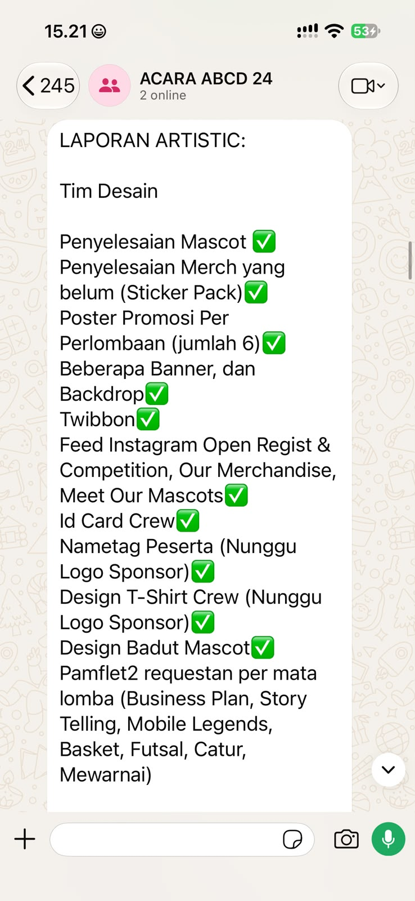

## Kompetensi target

Memisahkan event, fact, story, emotion, internal character, choice, dan action.

## Evidence wajib

- Satu episode komunikasi dengan diri sendiri.
- Initial story dan sedikitnya dua alternative narratives.
- Internal agreement dan artefak tindak lanjut yang menunjukkan pelaksanaannya.

## Konteks performance

**Tanggal dan setting:** Tanggal belum dicantumkan. Episode terjadi dalam konteks saya sebagai penanggung jawab tim acara lomba dan konser, setelah saya mengecek lebih lanjut weekly progress sub-divisi Design.

**Persons dan relationship:** Saya sebagai penanggung jawab tim dan anggota sub-divisi Design sebagai rekan kerja yang berada dalam koordinasi saya. Saya juga mengoordinasikan sub-divisi EO dan Lapangan.

**Objective dan initial state:** Tujuan saya adalah memahami kondisi pekerjaan secara objektif sebelum menentukan tindakan. Pada awalnya, saya percaya bahwa weekly progress yang diberikan sudah cukup menggambarkan kondisi pekerjaan.

## Episode komunikasi dengan diri sendiri

**Event dan fakta teramati:** Saya memberi setiap sub-divisi autonomy untuk menentukan cara kerja dalam batasan yang disepakati dan meminta weekly progress. Saya beberapa kali menerima dan menyetujui laporan dari Design. Setelah mengecek lebih lanjut, saya menemukan beberapa pekerjaan masih tertinggal dan kondisi tim Design lebih tertinggal daripada yang saya pahami dari laporan sebelumnya. Saat meminta klarifikasi, saya mendapat penjelasan bahwa selain workload yang padat, Software sempat mengalami gangguan sekitar seminggu sehingga tim tidak bisa mengerjakan pekerjaan desain seperti biasa. Rincian waktu dan dampaknya perlu dicocokkan dengan catatan atau percakapan yang tersedia.

**Story otomatis:** Sebelum memahami kendala tim, reaksi awal saya adalah berpikir bahwa tim Design terlalu santai dan saya terlalu memberikan kepercayaan kepada mereka. Saya juga sempat menilai keadaan tersebut sebagai kegagalan saya dalam melakukan management. Penilaian tentang sikap tim dan diri saya itu merupakan interpretasi awal, bukan fakta yang sudah saya pastikan.

**Emosi dan intensitas:** Marah dan kesal, dengan intensitas 8 dari 10.

**Sensasi tubuh dan dorongan:** Saya ingin meluapkan emosi dengan marah, tetapi menahannya agar suasana tetap kondusif.

**Narasi korban:** Saya sudah memberikan kebebasan dan kepercayaan kepada tim Design, tetapi mereka tidak menggunakan kesempatan tersebut dengan baik. Akhirnya, masalah tim menjadi tanggung jawab saya. Dalam narasi ini, saya menyalahkan tim dan merasa baru bisa memperbaiki keadaan setelah masalah terjadi.

**Narasi analitis:** Fakta yang saya ketahui adalah beberapa pekerjaan Design tertinggal dan laporan weekly progress tidak sepenuhnya menggambarkan kondisi aktual. Dari klarifikasi tim, keterlambatan juga berkaitan dengan workload yang padat dan gangguan Software sekitar seminggu. Sistem weekly progress saya mungkin belum cukup terperinci untuk menangkap kendala tersebut lebih awal. Saya dapat mengendalikan pertanyaan yang saya ajukan, kejelasan ekspektasi, frekuensi monitoring, dan tindakan setelah mendapat informasi baru.

**Narasi pertumbuhan:** Saya tetap ingin menjadi leader yang memberikan trust dan autonomy, tetapi saya belajar bahwa trust tidak berarti menghilangkan monitoring. Saya perlu membuat komunikasi progress lebih transparan, termasuk menanyakan kendala workload dan alat kerja, tanpa berubah menjadi micromanagement.

**Internal character dan pilihan:** Saya ingin bertindak sebagai reflective leader dan koordinator tim. Pilihan saya adalah menahan penilaian awal, memisahkan fakta dari asumsi, mencari informasi lebih lengkap, lalu memperbaiki monitoring tanpa menghilangkan autonomy tim.

**Internal agreement:** Pada weekly progress berikutnya, saya akan meminta rincian pekerjaan yang sudah selesai, pekerjaan yang belum selesai, hambatan—termasuk kendala alat kerja—dan bantuan yang dibutuhkan. Saya akan memeriksa hasilnya dengan membandingkan update tersebut dengan kondisi pekerjaan aktual atau laporan berikutnya. Artefak yang saat ini tersedia menunjukkan update daftar pekerjaan, tetapi belum membuktikan bahwa pertanyaan tentang hambatan sudah diajukan atau bahwa perbandingan tersebut telah dilakukan.

## Evidence

Artefak yang tersedia adalah screenshot laporan progress Tim Desain di grup acara:

Screenshot ini menampilkan daftar pekerjaan, sejumlah item dengan tanda centang, dan catatan bahwa beberapa item menunggu logo sponsor. Ini mendukung bahwa ada update status pekerjaan, tetapi screenshot tidak menampilkan tanggal, kondisi pekerjaan sebelum update, pertanyaan tentang hambatan alat kerja, jawaban atas pertanyaan tersebut, maupun perbandingan laporan dengan hasil aktual. Karena itu, artefak ini saja belum membuktikan bahwa internal agreement sudah dijalankan atau bahwa adaptasi saya telah terjadi.

Kontribusi yang saya refleksikan adalah komunikasi dan pengambilan keputusan saya sebagai penanggung jawab tim. Hasil kerja Design tidak saya klaim sebagai kontribusi pribadi. Untuk memverifikasi pelaksanaan agreement, saya perlu melampirkan artefak weekly progress berikutnya yang memperlihatkan pertanyaan tentang kendala alat kerja dan respons tim, atau catatan revisi yang membandingkan update dengan kondisi pekerjaan aktual. Bukti tindak lanjut juga perlu menunjukkan bagaimana saya menanggapi kendala dengan jelas dan menghargai tim; saya belum menyimpulkan dampaknya terhadap relationship tanpa bukti tersebut.

## Analisis komunikasi

| Elemen | Evidence dan analisis |
|---|---|
| Person & character | Saya cenderung memberi trust dan autonomy kepada anggota. Dalam episode ini, saya ingin bertindak sebagai reflective leader yang mengevaluasi situasi sebelum bereaksi. |
| Objective & state | State awal saya adalah percaya bahwa weekly progress cukup menggambarkan kondisi tim. Saya ingin mencapai pemahaman yang lebih objektif sebelum menentukan tindakan. |
| Repertoire & language | Saya menggunakan reflection, fact-checking, dan reframing. Pertanyaan internal saya: “Apa fakta yang benar-benar saya ketahui?” dan “Apa penjelasan lain selain asumsi awal saya?” |
| Response & adaptation | Dalam refleksi ini, saya memisahkan reaction awal dari fakta dan mempertimbangkan penjelasan tim tentang workload dan gangguan Adobe. Screenshot laporan menunjukkan adanya daftar update pekerjaan, tetapi tidak membuktikan bahwa saya sudah menanyakan hambatan atau membandingkan laporan dengan kondisi aktual. |
| Agreement/action | Agreement saya adalah menanyakan status, hambatan termasuk kendala alat kerja, dan kebutuhan bantuan, kemudian membandingkan update dengan kondisi aktual. Belum ada artefak yang dapat memverifikasi pelaksanaan langkah-langkah tersebut. |
| Relationship outcome | Dampak terhadap relationship belum dapat disimpulkan dari screenshot laporan. Saya perlu bukti percakapan tindak lanjut yang menunjukkan cara saya merespons hambatan secara jelas dan tetap menghargai anggota tim. |

## Penggunaan AI

Saya menggunakan AI untuk meninjau apakah tulisan refleksi sudah menggunakan bahasa Indonesia yang baik dan benar.

- **Alat dan peran AI:** AI membantu meninjau dan memperbaiki bahasa tulisan, bukan menentukan isi refleksi atau apa yang saya rasakan.
- **Prompt atau instruksi penting:** AI diarahkan untuk memperbaiki bahasa Indonesia, termasuk ejaan, tata bahasa, dan kejelasan kalimat, tanpa mengubah makna atau menambahkan informasi.
- **Output yang digunakan, diubah, atau ditolak:** Saya menggunakan saran perbaikan bahasa setelah memeriksanya. Fakta, refleksi, dan keputusan tetap berasal dari saya.
- **Accuracy, privacy, dan authority:** Saya mencocokkan hasil perbaikan dengan maksud tulisan saya, tidak memasukkan data pribadi anggota tim, dan tidak menganggap AI sebagai sumber fakta.
- **Apa yang tetap saya pelajari sebagai manusia:** Saya tetap melakukan refleksi, menentukan apa yang saya rasakan, membedakan fakta dari story, dan memilih tindakan yang akan saya lakukan.

## Feedback dan tindak lanjut

**Feedback yang diterima:** Belum dikumpulkan.

**Adaptation/replay:** Jika mengulang situasi ini, saya tidak akan langsung menyimpulkan bahwa tim Design terlalu santai. Saya akan memeriksa kondisi pekerjaan terlebih dahulu, menanyakan workload dan kendala alat kerja seperti gangguan Adobe, serta mengevaluasi apakah sistem monitoring yang saya gunakan sudah cukup. Pada tindak lanjut, saya akan menyimpan artefak yang mencatat pertanyaan dan respons tim, lalu membandingkan update dengan kondisi pekerjaan aktual tanpa menyamakan laporan status dengan bukti bahwa semua pekerjaan telah selesai.

**Next practice:** Pada weekly progress berikutnya, saya akan memastikan empat hal dibahas: pekerjaan yang sudah selesai, pekerjaan yang belum selesai, hambatan termasuk kendala alat kerja, dan kebutuhan bantuan. Saya akan menyimpan screenshot percakapan yang menunjukkan pertanyaan dan respons (dengan informasi pribadi disamarkan), serta catatan perbandingan antara update dan kondisi pekerjaan aktual yang mencantumkan tanggal, status, dan tindak lanjut. Saya juga akan mencatat bagaimana kebutuhan atau hambatan ditanggapi, agar klaim tentang adaptation dan relationship didukung artefak, bukan hanya refleksi setelah kejadian.

## Self-assessment

| Dimensi | Skor 1–4 | Evidence singkat |
|---|---:|---|
| Person & Character | 3 | Saya mengenali diri sebagai reflective leader dan membedakan keinginan untuk menjaga trust dari asumsi awal bahwa tim terlalu santai. Saya masih perlu membuktikan konsistensi character ini dalam tindakan nyata. |
| Objective & State | 3 | Tujuan memahami kondisi pekerjaan sebelum bertindak dan state awal yang percaya pada weekly progress sudah dijelaskan. Screenshot laporan mendukung adanya update pekerjaan, tetapi tidak memperlihatkan kondisi awal untuk perbandingan. |
| Repertoire, Language & AI | 3 | Saya menggunakan pemisahan fakta dan story, tiga alternative narratives, serta AI untuk membantu menyusun refleksi. Screenshot laporan memberi bukti update status, tetapi bukan bukti percakapan klarifikasi tentang kendala. |
| Response & Adaptation | 3 | Saya menyadari reaction awal dan mempertimbangkan workload serta kendala Adobe sebelum menyimpulkan. Pelaksanaan perubahan response dalam percakapan tindak lanjut belum terverifikasi oleh artefak yang tersedia. |
| Agreement, Action & Relationship | 3 | Agreement untuk menanyakan status, hambatan, dan kebutuhan bantuan sudah dirumuskan. Screenshot laporan belum membuktikan pertanyaan tersebut, perbandingan dengan kondisi aktual, atau dampaknya terhadap relationship. |

**Total:** 15 / 20

**Refleksi:** Penilaian ini menunjukkan bahwa saya sudah mampu mengenali reaction awal dan mempertimbangkan penjelasan lain, tetapi belum cukup membuktikan adaptation melalui tindakan dan hasil. Screenshot laporan yang tersedia menjadi bukti adanya update daftar pekerjaan dan beberapa status, bukan bukti bahwa saya sudah bertanya tentang kendala alat kerja atau membandingkan update dengan kondisi aktual. Ketika menemukan progress yang tidak sesuai dengan laporan, saya cenderung langsung menghubungkannya dengan sikap tim dan cara saya memimpin. Memisahkan fakta dari story membantu saya mempertimbangkan workload dan gangguan Adobe sebagai konteks, sementara sistem monitoring saya mungkin belum menangkap kendala itu lebih awal. Prioritas saya berikutnya adalah menjalankan agreement pada weekly progress berikutnya, menyimpan bukti pertanyaan dan respons, lalu membandingkan laporan dengan kondisi pekerjaan aktual. Saya belum dapat menyimpulkan dampak tindakan terhadap relationship sampai bukti tindak lanjut tersedia.

::: {.assessor-only}
### Assessment dosen

**Skor:** — / 20
**Evidence yang mendukung:** —
**Prioritas perbaikan:** —
**Keputusan:** Belum dinilai / Perlu revisi / Tercapai
:::
