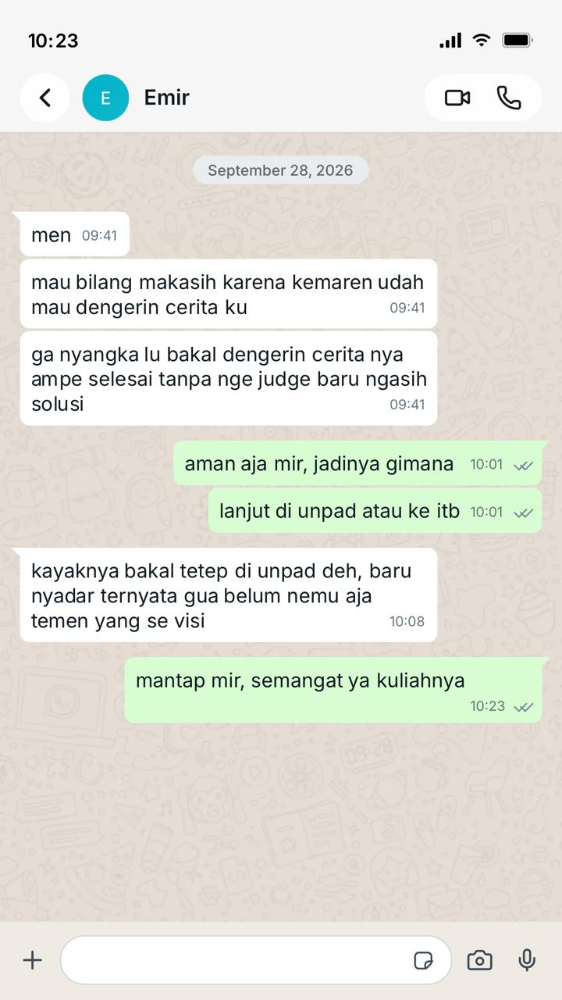

# Relationship Conversation

Evidence listening, clarity, dan relationship awareness melalui percakapan dengan teman dekat.

## Kompetensi target

Melakukan personal conversation dengan listening, clarity, dan awareness terhadap relationship serta kebutuhan mitra.

## Evidence wajib

- Catatan percakapan dengan mitra.
- Evidence listening dan response.
- Analisis relationship state sebelum dan sesudah percakapan, didukung observasi atau feedback yang tersedia.

## Konteks performance

**Tanggal dan setting:** 26 September 2026, percakapan tatap muka di kos.

**Persons dan relationship:** Saya dan Emir, seorang teman dekat. Hubungan kami cukup dekat dan terbuka sehingga kami dapat saling bercerita dan memberi masukan.

**Objective dan initial state:** Tujuan saya adalah membantu Emir memperoleh kejelasan mengenai pilihan kuliahnya tanpa mengambil keputusan untuknya. Emir sedang bingung mengenai keinginannya untuk pindah dari Universitas Padjadjaran ke Institut Teknologi Bandung pada jurusan yang sama dan mempertimbangkan beberapa konsekuensi.

## Episode percakapan

Emir bercerita bahwa ia mempertimbangkan pindah dari Universitas Padjadjaran ke Institut Teknologi Bandung pada jurusan yang sama. Ia merasa tidak memiliki cukup waktu untuk mempersiapkan SNBT dan mempertimbangkan jalur mandiri, tetapi biaya jalur tersebut menjadi perhatian karena sebelumnya ia sudah masuk Universitas Padjadjaran melalui jalur mandiri dengan biaya cukup besar. Ia juga merasa lelah menjalani osjur yang berlangsung lama bersamaan dengan perkuliahan.

Saya mencoba memahami alasan di balik keinginannya pindah, bukan hanya menanggapi pilihan kampusnya. Saya menyampaikan parafrasa berikut untuk mengecek pemahaman:

> “Mungkin yang membuat kamu ingin pindah bukan hanya soal kampusnya, tetapi juga karena kamu sedang kelelahan dengan osjur dan belum menemukan teman yang benar-benar cocok. Apakah saya menangkapnya dengan benar?”

Emir mengakui bahwa ia memang belum menemukan teman yang cocok. Saya juga bertanya apakah ia siap mengulang proses dari awal dan apakah ia yakin dapat membagi waktu untuk belajar masuk ITB. Jawaban Emir terhadap dua pertanyaan tersebut tidak tercatat dalam bahan yang tersedia, sehingga tidak saya simpulkan di sini.

Setelah itu saya menanyakan apakah ia ingin didengarkan, dibantu memikirkan pilihan, atau membutuhkan saran. Emir memilih mendapatkan saran dan bantuan untuk memikirkan pilihan tindakan. Saya tidak mengambil keputusan untuknya; tujuan saya adalah membantunya mempertimbangkan pilihannya.

## Analisis komunikasi

| Elemen | Evidence dan analisis |
|---|---|
| Person & character | Saya mengenali kebiasaan saya untuk cepat masuk ke mode *problem-solving*. Dalam percakapan ini saya berusaha hadir sebagai teman yang mendengarkan dan menghormati otonomi Emir. |
| Objective & state | Tujuan saya adalah membantu Emir memperoleh kejelasan tanpa menentukan pilihannya. Pada awal percakapan, ia bingung mengenai rencana pindah dan mempertimbangkan waktu, biaya, osjur, kuliah, serta lingkungan pertemanan. |
| Repertoire & language | Saya menggunakan parafrasa untuk memeriksa makna cerita, menyampaikan dugaan tentang rasa lelah dan kebutuhan akan lingkungan pertemanan secara tentatif, serta menanyakan bentuk bantuan yang ia inginkan. |
| Response & adaptation | Saya memberi Emir kesempatan menyelesaikan cerita dan tidak langsung menilai keinginannya pindah. Setelah mengetahui ia menginginkan saran dan bantuan memikirkan pilihan, saya dapat menyesuaikan bentuk respons dengan permintaannya. |
| Agreement/action | Emir memilih mendapatkan saran dan bantuan memikirkan pilihan. Kesepakatan atau keputusan akhir terkait rencana kuliahnya tidak disebutkan dalam catatan yang tersedia. |
| Relationship outcome | Dalam pesan 28 September, Emir berterima kasih karena saya mendengarkan ceritanya sampai selesai tanpa menghakimi sebelum memberi solusi. Ini merupakan feedback positif dan bukti interaksi lanjutan di luar sesi tatap muka. Namun, catatan yang tersedia belum cukup untuk menyimpulkan perubahan kedekatan atau penurunan ketegangan dalam jangka panjang. |

## Evidence

Screenshot percakapan lanjutan dengan Emir pada 28 September 2026 menjadi evidence feedback setelah sesi tatap muka. Emir menulis bahwa ia berterima kasih karena saya mendengarkan ceritanya sampai selesai tanpa menghakimi sebelum memberi solusi. Dalam percakapan yang sama, ia menyampaikan kemungkinan tetap kuliah di Unpad dan menyadari belum menemukan teman yang sevisi; saya membalas dengan dukungan. Pesan ini mendukung adanya feedback positif dan interaksi lanjutan di luar sesi utama. Bukti tersebut menunjukkan respons Emir pada percakapan itu, tetapi tidak cukup untuk memastikan perubahan relationship state jangka panjang.

Catatan latihan dan refleksi tertulis juga menjadi dasar analisis episode. Transcript lengkap atau catatan observer tidak dilampirkan. Kutipan parafrasa di atas digunakan untuk menggambarkan kalimat yang disampaikan; bila bukan kata-kata persis, kutipan tersebut perlu dipahami sebagai parafrasa. Catatan yang tersedia tidak menunjukkan adanya ketidaksepakatan yang perlu diperbaiki (*repair*), sehingga saya tidak mengklaim telah melakukan repair.

## Feedback dan tindak lanjut

**Feedback yang terdokumentasi:** Pada pesan 28 September yang dilampirkan, Emir berterima kasih karena saya mendengarkan ceritanya sampai selesai tanpa menghakimi sebelum memberi solusi. Pesan yang tersedia mendukung feedback tersebut. Catatan yang tersedia tidak menunjukkan feedback bahwa saya terlalu cepat mencari penyelesaian; karena itu, poin tersebut tidak saya sajikan sebagai pernyataan Emir.

**Adaptation/replay:** Jika percakapan serupa terjadi lagi, saya akan memberi ruang bagi Emir untuk menyelesaikan ceritanya, mengecek bentuk dukungan yang ia inginkan, dan menanggapi tanpa mengarahkan pilihannya. Jika muncul ketidaksepakatan atau ketegangan, saya akan mengklarifikasi bagian yang berbeda, mendengarkan dampaknya bagi teman, dan memeriksa apakah respons atau kesepakatan lanjutan sudah membantu; saya belum memiliki bukti bahwa situasi seperti itu terjadi dalam episode ini.

**Next practice:** Pada interaksi lanjutan dengan Emir, saya akan menanyakan secara terbuka bagaimana perasaannya setelah percakapan sebelumnya dan apakah ada hal yang masih terasa mengganjal. Saya akan mencatat tanggal, konteks, responsnya, serta tindakan tindak lanjut secara ringkas tanpa mengubah kata-katanya; bila ia bersedia, saya akan meminta izin sebelum menyimpan atau melampirkan pesannya. Saya juga akan mengamati interaksi berikutnya di luar sesi utama—misalnya apakah percakapan tetap terbuka dan saling nyaman—tanpa menyimpulkan kedekatan meningkat hanya dari satu pesan. Jika feedback atau artefak baru belum ada, saya akan menandainya belum tersedia, bukan mengisi seolah-olah sudah terjadi.

## Penggunaan AI

AI digunakan untuk membantu menyusun dan merapikan refleksi ini berdasarkan catatan yang saya berikan. Pengalaman, isi percakapan, dan feedback berasal dari catatan saya; AI tidak digunakan sebagai sumber fakta atau sebagai pengganti konfirmasi dari Emir. Kutipan yang tidak dipastikan verbatim diperlakukan sebagai parafrasa.

## Self-assessment

| Dimensi | Skor 1–4 | Evidence singkat |
|---|---:|---|
| Person & Character | 3 | Saya mengenali kecenderungan untuk cepat menyelesaikan masalah dan berusaha hadir sebagai pendengar. |
| Objective & State | 3 | Tujuan percakapan dan kebingungan Emir mengenai pilihan kuliah dijelaskan. |
| Repertoire, Language & AI | 3 | Saya menggunakan parafrasa, dugaan tentatif, pertanyaan kebutuhan, dan AI sebagai alat bantu penulisan yang diperiksa kembali. |
| Response & Adaptation | 3 | Saya menahan penilaian awal dan bertanya bentuk bantuan yang diinginkan sebelum memberi saran. |
| Agreement, Action & Relationship | 3 | Screenshot 28 September menunjukkan feedback positif dan interaksi setelah sesi utama. Bukti ini belum mengukur perubahan relationship state jangka panjang; belum ada catatan repair atau observasi interaksi berikutnya. |

**Total:** 15 / 20

**Refleksi:** Saya cenderung cepat masuk ke mode *problem-solving* ketika seseorang bercerita. Pesan lanjutan pada 28 September memberi bukti konkret bahwa Emir merasa didengarkan dan tidak dihakimi dalam percakapan tersebut. Namun, satu feedback ini belum membuktikan perubahan kedekatan jangka panjang, dan catatan yang ada tidak menunjukkan ketidaksepakatan yang memerlukan repair. Pada interaksi berikutnya, saya akan menanyakan perasaannya setelah percakapan, mencatat respons dengan izin, dan mengamati apakah komunikasi tetap terbuka di luar sesi utama. Saya akan membatasi kesimpulan pada hal-hal yang didukung catatan dan evidence.

::: {.assessor-only}
### Assessment dosen

**Skor:** — / 20
**Evidence yang mendukung:** —
**Prioritas perbaikan:** —
**Keputusan:** Belum dinilai / Perlu revisi / Tercapai
:::
